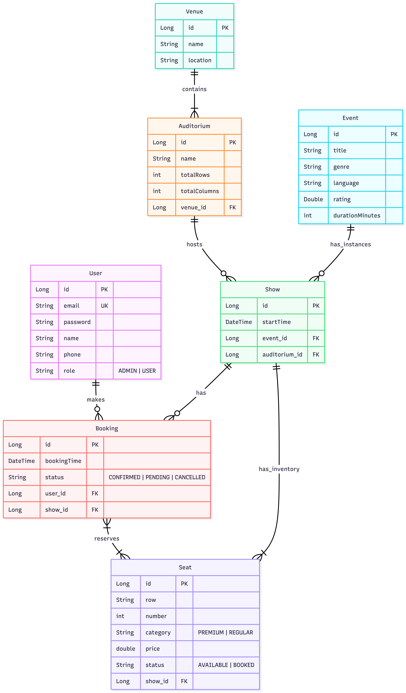
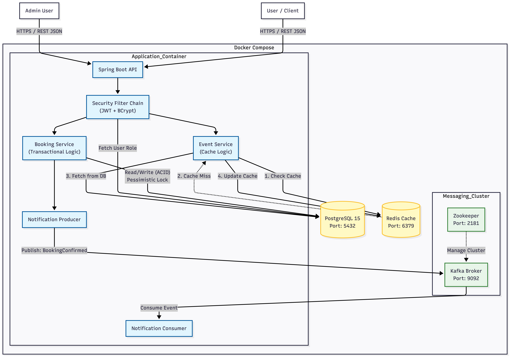

# 🎟️ Event Booking System (Backend)

## 📋 Overview

A production-grade backend system for an online event and ticket booking platform (similar to BookMyShow). This project implements a robust REST API using **Spring Boot**, featuring ACID-compliant seat locking, high-performance caching, secure authentication, and event-driven notifications.

## 🚀 Tech Stack

- **Language:** Java 21
- **Framework:** Spring Boot 3 (Web, Data JPA, Security)
- **Database:** PostgreSQL 15
- **Cache:** Redis (Lettuce Client)
- **Messaging:** Apache Kafka (Spring Kafka)
- **Containerization:** Docker & Docker Compose
- **Build Tool:** Maven

## ✨ Key Features

### 1. 🛡️ Security & User Management

- **JWT Authentication:** Stateless security with Access and Refresh tokens.
- **RBAC (Role-Based Access Control):** distinct `ADMIN` and `USER` roles.
- **Password Encryption:** BCrypt hashing for secure storage.
- **Input Validation:** Strict validation using Hibernate Validator (`@Valid`).

### 2. 🎬 Event & Show Management

- **CRUD Operations:** Admins can create Events, Venues, Auditoriums, and Shows.
- **Deep Search:** Users can filter events by City, Genre, Language, and Date.
- **Dynamic Inventory:** Seats are generated per Show instance with specific pricing and categories (Premium/Regular).

### 3. ⚡ High Performance & Scalability

- **Redis Caching:** Frequently accessed data (Event listings) is cached to reduce DB load (Cache-Aside pattern).
- **Database Indexing:** Optimized queries on `title`, `genre`, and `location`.

### 4. 🔒 Reliability & Concurrency

- **Double-Booking Protection:** Implemented **Pessimistic Locking** (`SELECT ... FOR UPDATE`) on Seat rows.
- **ACID Transactions:** Ensures bookings are atomic; either all seats are booked, or none are.
- **Integrity Constraints:** Prevents deletion of Shows/Auditoriums if bookings already exist.

### 5. 📨 Notifications

- **Event Driven:** Decouples booking logic from notifications using **Kafka**.
- **Fault Tolerance:** If the notification service fails, the booking remains valid (Eventual Consistency).

---

## 🏗️ Architecture & Database Design

This project follows **Clean Architecture** principles and **SOLID** design patterns.

### Entity Relationship Diagram (ERD)



---

### Architecture Diagram



---

### Booking Flow Sequence Diagram


---

## 🔌 API Testing

Import the Postman collection to test the API locally.
[Download Postman Collection](postman/BookingSystemTest.postman_collection.json)

## 🛠️ Setup & Installation

### Prerequisite

- **Docker Desktop** (Must be installed and running)

### The "One-Click" Run

This command builds the Java application, creates the Database, sets up Redis/Kafka, and networks them together.

```bash
docker-compose up --build
```
